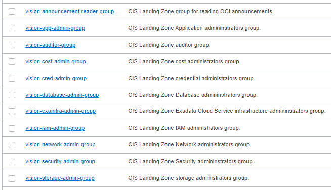

# OCI Groups Module Usage Example - Vision groups
## Introduction

This example shows how to deploy Identity and Access Management (IAM) groups of users in Oracle Cloud Infrastructure (OCI) for a hypothetical Vision entity. The groups are the same deployed by [CIS Landing Zone Quick Start](https://github.com/oracle-quickstart/oci-cis-landingzone-quickstart).

It creates the following groups as shown in the picture below:



## Using this example
1. Rename *input.auto.tfvars.template* to *\<project-name\>.auto.tfvars*, where *\<project-name\>* is any name of your choice. 

**NOTE**: Each object in the *groups* map is indexed by an uppercase string, like *IAM-ADMIN-GROUP*, *CRED-ADMIN-GROUP*, etc. These strings are used by Terraform as keys to the actual managed resources. They can actually be any random strings, but once defined they **must not be changed**, or Terraform will try to destroy and recreate the groups.

1. Within *\<project-name\>*.auto.tfvars, provide tenancy connectivity information

2. In this folder, run the typical Terraform workflow:
```
terraform init
terraform plan -out plan.out
terraform apply plan.out
```